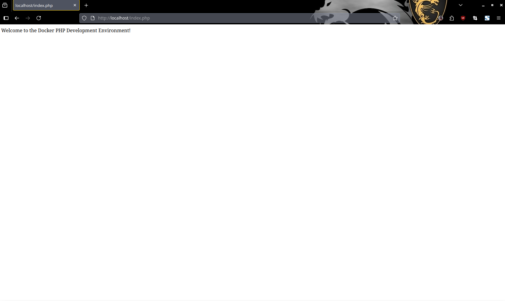
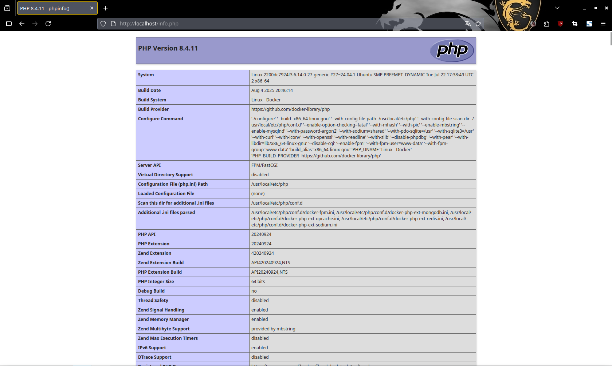

## DOCKER TEMPLATE ## 

Simple Docker template for development using 
- Nginx
- PHP 8.4 FPM
- SQL Database:
    - MySQL
- No-SQL Databases:
    - MongoDB
- NodeJS
- Composer

## Requirements ##

- Docker
- Docker Compose

## How to use ##

1. Clone the repository
2. Create a .env file and set the environment variables
3. Add your project files to the src directory 
4. Run the command: docker-compose build
5. Run the command: docker-compose up -d (so it will run in the background)
6. Open your browser and go to http://localhost
7. Happy coding! 
8. (Optional) If you want to connect to dbeaver set host as localhost, port as 3306, user as <MYSQL_USER> on your .env file and password as <MYSQL_PASSWORD> on your .env file as well.

### Nginx Configuration ###

The Nginx configuration file is located at: ./nginx/default.conf

You can change the port to your needs in the Nginx configuration file.

By default the port is set to 80, it's set on the default.conf file and also on the docker-compose.yml file. 

### PHP Configuration ###

The PHP configuration file is located at: ./php/Dockerfile

The extensions that are installed are:

- bcmath
- calendar
- exif
- gd
- intl
- mbstring
- mysqli
- opcache
- pcntl
- pdo_mysql
- soap
- sockets
- zip
- curl

You can add more extensions by adding them to the list.

## Project Structure ##

```
├── .dockerignore
├── README.md
├── docker-compose.yml
├── nginx
    ├── .default.conf.kate-swp
    └── default.conf
├── node
    ├── .dockerignore
    └── Dockerfile
├── package-lock.json
└── php
    ├── .dockerignore
    └── Dockerfile
└── src
    ├── your_project_files
└── .gitignore
```

#### Remember to change the port in the docker-compose.yml file if you change the port in the default.conf file ####

## Docker Commands v2 ##

| Command | Description | 
| --- | --- |
| docker compose up | Run all containers |
| docker compose up -d | Run all containers in the background |
| docker compose down | Stop and remove all containers |
| docker compose build | Build images |
| docker compose build --no-cache | Build images without cache |
| docker compose restart | Restart all containers |
| docker compose logs -f | Follow the logs of the containers |
| docker compose ps -a | List all containers |
| docker compose exec php bash | Enter the container php bash |
| docker compose exec node bash | Enter the container node bash |
| docker compose exec mysql bash | Enter the container mysql bash |
| docker compose exec mongodb bash | Enter the container mongodb bash |

### Troubleshooting ###

Create a .env file and set the environment variables in it.

If you have any issues with MySQL connections, delete the mysql_data volume and directory and try again.

If you have any issues with MongoDB connections, delete the mongodb_data volume and directory and try again.

Check the logs for any errors.


### Docker compose up command ### 
 

### If you visit http://localhost/index.php ###


### Remember to remove the info.php on production ### 
 


### Additional Information ###

- If you want the database to be persistent you can use the volumes in the docker-compose.yml file. (./mysql-data)
- If you want to use the database in a different port you can change the port in the docker-compose.yml file. 
- Let me know if you find any bugs or have any suggestions.
- Hit me up on Ig: @vinicordeirox or LinkedIn https://www.linkedin.com/in/vinicordeirox/
- Star the repository on GitHub: https://github.com/vinicius-g-cordeiro/docker-template <a href="https://github.com/vinicius-g-cordeiro/docker-template" target="_blank"> </a>

### Contact Info ###
| Link | Description |
| --- | --- |
| https://github.com/vinicius-g-cordeiro | GitHub |
| https://instagram.com/vinicordeirox | Instagram |
| https://www.linkedin.com/in/vinicordeirox/ | LinkedIn |

<i style="font-size: 12px;">&copy; Copyright, All rights reserved  (2025 Vinícius Gonçalves Cordeiro)</i>
